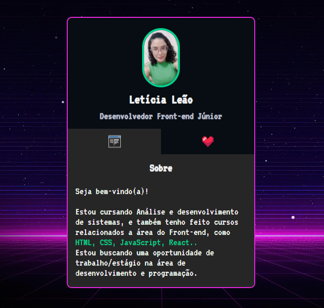

# Mini Portfólio

## Projeto de um mini portfólio desenvolvido durante a Mapa Dev Week com os irmãos do DEV em dobro,  usamos HTML, CSS e JavaScript. 👩🏽‍💻

### [Clique aqui para acessar a página 👇🏽](https://letsle.github.io/Mini-Portfolio/) 

